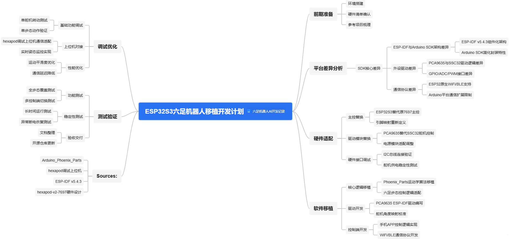

# 六足机器人AI开发记录
## 项目思维导图创作

基于Github项目移植软件逻辑到ESP32S3平台。参考我提供的链接，生成一份开发计划和概要，主要注意移植时ESP32平台和arduino平台的SDK差异。

* 六足机器人项目（https://github.com/KurtE/Arduino_Phoenix_Parts），参考ssc32+PS2组合，移植到PCA9635+ESP32+APP组合；
* 调试上位机（https://github.com/mithi/hexapod）；ESP-IDF（https://github.com/espressif/esp-idf/releases/tag/v5.4.3）；
* 硬件设计（https://github.com/SmallpTsai/hexapod-v2-7697）

## 项目需求
有了项目差异的思维导图，下面来编写一下系统详细设计，用来指导后续开发工作。
我想要使用Github上的两个开源项目实现自己的六足机器人项目。
* Arduino_Pheonix项目的软件架构很好，有抽象逻辑、有逻辑分层、适合移植不同项目不同平台；
* Hexpod项目我更看重他的硬件设计，并且已经准备好了所有硬件进行调试；
* 虽然Hexpod项目的软件也使用了C++抽象逻辑，但是不够彻底，架构也比较混乱。

综上，我更偏向于使用Hexpod的硬件+PCA9685控制器作为底层驱动；ESP32替换Arduino实现更强更丰富的逻辑，后续还可以作为低级控制器连接树莓派等ARM开发板实现一些AI功能；有了ESP32就可以进行联网，还能够使用手机App进行无线控制，实现更多接口和功能；同时也可以保留PS2控制交互接口。

调试就用ESP32-S3的USB接口作为调试端口，结合Github项目hexpod上位机软件，快速验证。
