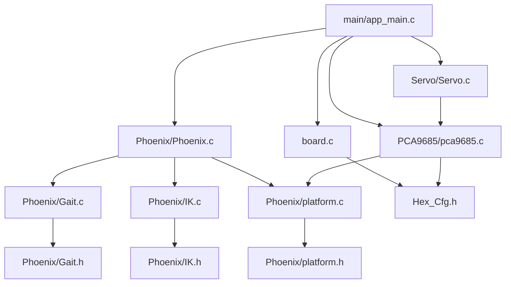

# 六足机器人 — 项目需求与系统架构

> 基于 [开发记录.md](./开发记录.md) 和当前代码库现状整理，用于指导后续开发。

---

## 1. 项目起源与目标

### 1.1 参考项目

| 参考项目 | 作用 | 链接 |
|---|---|---|
| **Arduino_Phoenix_Parts** | 软件架构参考（抽象分层、步态/IK 逻辑） | https://github.com/KurtE/Arduino_Phoenix_Parts |
| **hexapod** (mithi) | 调试上位机 + 运动学参考 | https://github.com/mithi/hexapod |
| **hexapod-v2-7697** (SmallpTsai) | 硬件结构设计 | https://github.com/SmallpTsai/hexapod-v2-7697 |
| **ESP-IDF v5.4.3** | 目标运行平台 | https://github.com/espressif/esp-idf/releases/tag/v5.4.3 |

### 1.2 项目定位

- **硬件**：hexapod-v2-7697 结构 + PCA9685 舵机驱动
- **主控**：ESP32-S3（替代原 Arduino 平台）
- **软件架构**：移植 Arduino_Phoenix 的分层抽象设计
- **控制接口**：手机 App（WiFi/BLE）为主，保留 PS2 手柄
- **调试**：USB 串口 + hexapod 上位机
- **远期**：ESP32 作为下层控制器，连接树莓派等 ARM 开发板实现 AI 功能

### 1.3 与原始 Arduino_Phoenix (ssc32+PS2) 的核心差异

| 维度 | 原始项目 | 本项目 |
|---|---|---|
| 平台 | Arduino | ESP32-S3 + ESP-IDF |
| 舵机控制 | SSC32 串口舵机控制器 | PCA9685 I2C PWM |
| 控制方式 | PS2 无线手柄 | 手机 App（WiFi/BLE）+ 保留 PS2 |
| 调试 | 串口 | USB 串口 + hexapod 上位机 |

---

## 2. 当前工程结构

```
Phoenix_Hexapod_ESP32/
├── CMakeLists.txt                      # 根 CMake，ESP-IDF 项目入口
├── main/                               # 应用入口 + 板级支持
│   ├── CMakeLists.txt                  # main 组件注册
│   ├── app_main.c                      # 应用入口（目前为 PCA9685 测试代码）
│   ├── board.h                         # 板级 I2C 初始化声明
│   └── board.c                         # 板级 I2C 初始化实现
├── components/                         # 软件组件库
│   ├── Phoenix/                        # 核心：六足机器人逻辑层
│   │   ├── CMakeLists.txt              # 组件注册（Phoenix/Gait/IK 已注释）
│   │   ├── inc/
│   │   │   ├── Phoenix.h               # PhoenixLoop() 声明
│   │   │   ├── Hex_Cfg.h               # 【单一配置文件】几何/步态/I2C/PCA9685 寄存器
│   │   │   ├── Gait.h                  # 步态结构体 + API（当前被注释）
│   │   │   ├── IK.h                    # 逆运动学 API（当前被注释）
│   │   │   └── platform.h              # 平台抽象：millis() / delay()
│   │   └── src/
│   │       ├── Phoenix.c               # 主控制循环：步态 + IK 联调
│   │       ├── Gait.c                  # 步态实现（三脚步态 TriPod）
│   │       ├── IK.c                    # 逆运动学求解器
│   │       └── platform.c              # ESP32 平台实现（esp_timer + FreeRTOS）
│   ├── PCA9685/                        # PCA9685 PWM 驱动（I2C）
│   │   ├── CMakeLists.txt
│   │   ├── pca9685.h                   # 驱动 API
│   │   └── pca9685.c                   # I2C 寄存器读写实现
│   └── Servo/                          # 舵机抽象层
│       ├── inc/
│       │   ├── Servo.h                 # servo_set_angle() / servo_commit()
│       │   └── Servo_Cfg.h             # 舵机数量/PWM参数/角度范围
│       └── Servo.c                     # 角度→PWM 转换 + 批量更新
└── Docs/
    ├── 开发记录.md                      # 开发概要记录
    ├── 移植开发差分和注意事项.png         # 迁移差异思维导图
    ├── PCA9685.pdf                     # PCA9685 数据手册
    └── esp32-s3_datasheet_cn.pdf       # ESP32-S3 中文数据手册
```

---

## 3. 抽象层次架构

系统采用 **自顶向下 5 层** 的分层架构，每一层只依赖下层：

```
┌─────────────────────────────────────────────────────────────┐
│  Layer 5: 应用交互层 (Application)                           │
│  - 手机 App 通信 (WiFi/BLE)                                  │
│  - PS2 手柄输入解析                                          │
│  - 串口命令 / 上位机协议                                      │
│  - 模式切换 (遥控/自动/AI)                                    │
├─────────────────────────────────────────────────────────────┤
│  Layer 4: 运动控制层 (Motion Control)                        │
│  - 身体姿态控制 (Body IK + 平移/旋转)                         │
│  - 步态选择与切换 (TriPod / Ripple / Wave)                    │
│  - 步态状态机与步进管理                                       │
│  - 动作序列 (站立/蹲下/转向/特殊步态)                          │
├─────────────────────────────────────────────────────────────┤
│  Layer 3: 运动学层 (Kinematics)                               │
│  - PhoenixLoop() 主循环调度                                  │
│  - 足端坐标 → 关节角度 逆运动学 (LegIK)                        │
│  - 身体姿态 → 各腿足端位置 (Body IK)  【待实现】               │
│  - 坐标变换 / 轨迹生成                                       │
├─────────────────────────────────────────────────────────────┤
│  Layer 2: 舵机驱动抽象层 (Servo Abstraction)                  │
│  - servo_set_angle(index, angle)   角度设置 (角度单位)         │
│  - servo_commit()                  批量更新到硬件              │
│  - 角度 → 脉宽 → PWM Tick 转换                               │
│  - 角度限幅 / 保护                                           │
├─────────────────────────────────────────────────────────────┤
│  Layer 1: 硬件驱动层 (Hardware Drivers)                       │
│  - PCA9685 I2C PWM 驱动                                      │
│  - board.c I2C 总线初始化                                    │
│  - platform.c 平台抽象 (millis/delay → FreeRTOS/esp_timer)   │
├─────────────────────────────────────────────────────────────┤
│  Layer 0: 硬件抽象层 (HAL / BSP)                              │
│  - ESP32-S3 GPIO / I2C 外设                                  │
│  - FreeRTOS 任务调度                                         │
│  - ESP-IDF 框架                                             │
└─────────────────────────────────────────────────────────────┘
```

### 3.1 各层职责与现状

| 层 | 现有代码 | 完成度 | 待实现 |
|---|---|---|---|
| **L5 应用交互** | 无 | 0% | WiFi/BLE 通信栈、App 协议、PS2 驱动、命令行解析 |
| **L4 运动控制** | 无 | 0% | Body IK、多步态切换、姿态控制、动作序列 |
| **L3 运动学** | `Phoenix.c` `Gait.c` `IK.c` | ~30% | Body IK、轨迹内插、完整步态类型 |
| **L2 舵机抽象** | `Servo/` | ~70% | 与 Phoenix 层的数据接口对接、舵机编号映射 |
| **L1 硬件驱动** | `PCA9685/` `board.c` `platform.c` | ~85% | 多路 PCA9685 支持、I2C 错误恢复 |
| **L0 HAL** | ESP-IDF 框架 | 100% | — |

### 3.2 关键数据流

```
App/PS2 输入
    │
    ▼
┌──────────────┐    姿态命令 (BodyX, BodyY, BodyZ, RotX, RotY, RotZ)
│ L5 应用交互   │────────────────────────────────────────────────────┐
└──────────────┘                                                    │
                                                                    ▼
┌──────────────┐    身体逆运动学 (每腿足端 XYZ 目标)                  │
│ L4 运动控制   │─── Body IK ──→ 6× (LegX, LegY, LegZ) ────────────┐ │
│              │   步态机 ──→ 抬腿/落腿状态                          │ │
└──────────────┘                                                    │ │
                                                                    ▼ ▼
┌──────────────┐    单腿逆运动学 (关节角度)                          │
│ L3 运动学    │─── LegIK(LegX, LegY, LegZ) ──→ (Coxa, Femur, Tibia) │
│  PhoenixLoop │    ×6 条腿, 50-100Hz 刷新                         │
└──────────────┘                                                    │
                                                                    ▼
┌──────────────┐    servo_set_angle(0..17, angle)                  │
│ L2 舵机抽象   │──→ 角度→PWM 转换 → 缓冲                            │
│              │──→ servo_commit() 批量写入 PCA9685                 │
└──────────────┘                                                    │
                                                                    ▼
┌──────────────┐    I2C 写入 PCA9685 寄存器                         │
│ L1 硬件驱动   │──→ 16通道 × 12-bit PWM 输出                       │
└──────────────┘                                                    │
                                                                    ▼
                                                              舵机 (18个)
```

### 3.3 组件依赖关系



---

## 4. 核心数据结构（从 Arduino_Phoenix 移植）

### 4.1 步态结构体 `Gait_t`

```c
typedef struct {
    uint8_t  StepsInGait;      // 一个步态周期的总步数
    uint8_t  NrLiftedPos;      // 同时抬起的腿数
    uint8_t  FrontDownPos;     // 前腿落下位置（步数偏移）
    uint8_t  LiftDivFactor;    // 抬腿分割因子
} Gait_t;
```

### 4.2 腿部关节角度

```c
// 每条腿 3 个关节
typedef struct {
    float Coxa;    // 基节角度 (rad)
    float Femur;   // 股节角度 (rad)
    float Tibia;   // 胫节角度 (rad)
} LegJoints_t;
```

### 4.3 身体姿态

```c
typedef struct {
    float BodyX, BodyY, BodyZ;     // 身体平移 (mm)
    float RotX,  RotY,  RotZ;      // 身体旋转 (deg)
    float TravelLengthX;           // XZ 平移分量
    float TravelLengthZ;
} BodyPose_t;
```

---

## 5. 已发现的问题与待办事项

### 5.1 代码问题

| 问题 | 位置 | 说明 |
|---|---|---|
| **头文件注释不完整** | [Gait.h](components/Phoenix/inc/Gait.h) / [IK.h](components/Phoenix/inc/IK.h) | `Gait_t` 结构体和 API 声明被注释掉，但 `.c` 文件中实际使用 |
| **CMakeLists 未编译核心** | [Phoenix/CMakeLists.txt](components/Phoenix/CMakeLists.txt) | `Phoenix.c`, `Gait.c`, `IK.c` 被注释，当前未编译 |
| **Servo.c 接口不一致** | [Servo.c](components/Servo/Servo.c) | `pca9685_init` 调用签名与 [pca9685.h](components/PCA9685/pca9685.h) 声明不匹配 |
| **Hex_Cfg.h 职责混杂** | [Hex_Cfg.h](components/Phoenix/inc/Hex_Cfg.h) | 几何参数、PCA9685 寄存器、I2C 引脚定义混在同一文件 |
| **app_main 双版本** | [app_main.c](main/app_main.c) | 活跃代码是 PCA9685 测试，Phoenix 循环被 `#if 0` 屏蔽 |

### 5.2 架构待实现

| 优先级 | 模块 | 说明 |
|---|---|---|
| **P0** | 修复编译链 | 取消注释头文件声明，恢复 CMakeLists 中的源文件 |
| **P0** | 统一配置管理 | 拆分 Hex_Cfg.h：几何/步态参数 与 硬件引脚/I2C 分离 |
| **P1** | 舵机编号映射 | 定义 6 腿 × 3 关节 = 18 舵机的物理编号与软件索引的映射表 |
| **P1** | Body IK | 身体姿态 → 6 腿足端坐标的逆运动学 |
| **P2** | 多步态支持 | Ripple / Wave / Tripod 步态实现与运行时切换 |
| **P2** | 通信协议 | WiFi/BLE App 通信协议定义 + PS2 驱动 |
| **P3** | 上位机对接 | 参考 hexapod 上位机协议，实现调试数据上报 |

---

## 6. 配置参数一览 (Hex_Cfg.h)

### 6.1 机器人几何 (mm)

| 参数 | 值 | 说明 |
|---|---|---|
| `COXA_LENGTH` | 52.0 | 基节长度 |
| `FEMUR_LENGTH` | 82.0 | 股节长度 |
| `TIBIA_LENGTH` | 140.0 | 胫节长度 |
| `BODY_X` | 75.0 | 身体 X 向半径 |
| `BODY_Y` | 60.0 | 身体 Y 向半径 |

### 6.2 步态参数

| 参数 | 值 | 说明 |
|---|---|---|
| `DEFAULT_GAIT_SPEED` | 60 ms | 单步时间间隔 |
| `LEG_LIFT_HEIGHT` | 30.0 mm | 抬腿高度 |

### 6.3 硬件引脚 (I2C)

| 参数 | 值 | 说明 |
|---|---|---|
| `I2C_PORT_NUM` | 0 | I2C 端口号 |
| `I2C_SDA_GPIO` | 8 | SDA 引脚 |
| `I2C_SCL_GPIO` | 9 | SCL 引脚 |
| `I2C_FREQ_HZ` | 400000 | I2C 频率 400kHz |

---

*文档生成时间：2026-07-06，基于当前 `dev/esp32_Code_C` 分支代码。后续随开发更新。*
